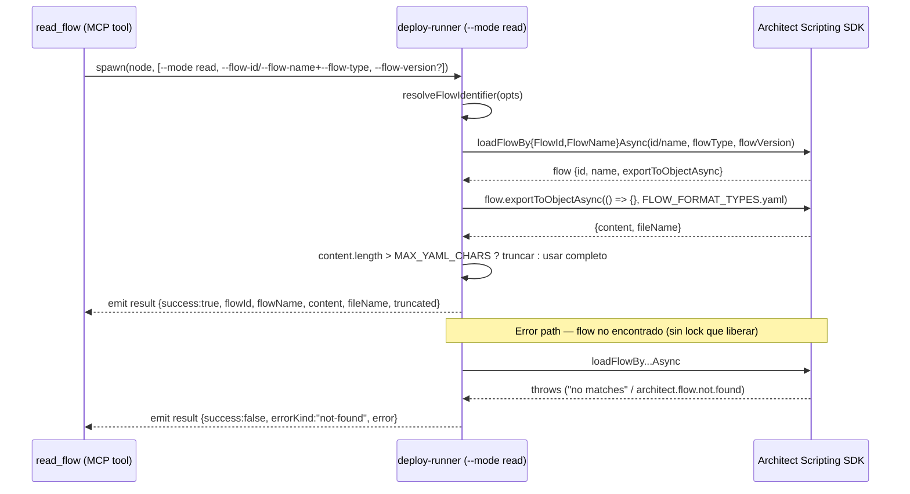

# Design: `read_flow` — Exponer un Flow Existente como Contexto de Solo Lectura

## Technical Approach

Reutilizar el mismo bootstrap de sesión/interceptores de
`src/deploy-runner/index.ts` (HTTPS patch, TRACE patch, `installLogging`,
`startSession`) que ya usan `--mode create`/`--mode update`, agregando un
tercer modo `--mode read` que llama a `archFactoryFlows.loadFlowBy{FlowId,
FlowName}Async` (SIN checkout/lock — hermano explícito de
`checkoutAndLoadFlowBy...Async` en `types.d.ts`, confirmado líneas
3218/3231) y exporta el flow con `flow.exportToObjectAsync(cb,
archEnums.FLOW_FORMAT_TYPES.yaml)`. Un nuevo tool MCP `read_flow` (mismo
spawn+NDJSON shape que `update-flow.ts`) expone esto al LLM caller.
Diferencia clave frente a `update_flow`: al no adquirir lock, el catch path
del deploy-runner NO necesita `unlockAsync()` — hay un estado menos que
gestionar y un modo de fallo menos (nunca puede haber "unlock también
falló").

## Architecture Decisions

| Decisión | Elección | Alternativa rechazada | Racional |
|---|---|---|---|
| Superficie del tool | Tool dedicado `read_flow` | Parámetro sobre `flow_dependencies` o `deploy_flow` | `annotations` MCP son estáticos por tool; `readOnlyHint: true` no puede convivir con `deploy_flow` (destructivo). Mismo argumento que ya resolvió `update_flow`. |
| Dispatch CLI | `--mode read` sumado al flag existente (`create\|update\|read`) | Script nuevo | Reutiliza los ~150 líneas de bootstrap (HTTPS/console.log/session) sin duplicarlos — mismo racional que llevó a `--mode update`. |
| Nombre del tool (`tool-name`, abre en state.yaml) | **`read_flow`** — confirmado | `get_flow`, `export_flow` | `read_flow` es simétrico con `update_flow` (verbo + "flow"), y distingue claramente de `flow_dependencies` (metadata) y `export_flow` (que sugeriría un archivo en disco, no texto inline). |
| `flowFormat` (`flow-format-param`, abre en state.yaml) | Fijo en `archEnums.FLOW_FORMAT_TYPES.yaml`, no expuesto como parámetro — confirmado | Exponer `architect`/`yaml` como enum | `architect` es un formato semi-opaco de backup/restore sin caso de uso como contexto legible por LLM; exponerlo agregaría superficie de API sin beneficio (ver proposal, Out of Scope). |
| Ubicación de `resolveFlowIdentifier` (`resolve-flow-identifier-sharing`, abre en state.yaml) | Reutilizar tal cual desde `update-helpers.ts`, sin extraer/renombrar | Extraer a un módulo neutral (`flow-helpers.ts`) compartido | El archivo ya es side-effect-free (comentario explícito en su header) e importable por ambos modos sin tocar `index.ts`'s interceptores. Con solo 2 consumidores (update, read) no se justifica el churn de un rename que tocaría imports en 2+ archivos y ampliaría el diff de esta PR. Regla de tres: si aparece un tercer consumidor, extraer entonces. Se actualiza el comentario de cabecera del archivo para reflejar que ya no es exclusivo de "update". |
| Guard de tamaño (`size-guard-strategy`, abre en state.yaml) | Truncar `content` a `MAX_YAML_CHARS = 200_000` con mensaje explícito de truncamiento + sugerencia de acotar `flowVersion` | (a) sin guard, dejar pasar cualquier tamaño; (b) bloquear con error si excede el límite | Un YAML sin cortar puede saturar el contexto del LLM sin aviso — igual de peligroso que el colapso de errores que `openspec/config.yaml` ya prohíbe para otro caso. Truncar (no bloquear) preserva utilidad parcial; anunciar el corte evita que el LLM caller asuma que vio el flow completo. 200k caracteres es una estimación conservadora (~50k tokens a ~4 char/token) sin flows reales medidos — **valor de arranque a validar empíricamente en `sdd-apply`** contra flows reales de Calidda, ajustable sin romper el contrato del tool. |
| Validación cruzada del schema Zod | `ZodRawShape` plano + `if` post-parse en el handler (2 mensajes distintos) | `z.object({...}).refine(...)` | **Bug ya confirmado en producción** (`update-flow` tasks.md 2.6): el SDK `@modelcontextprotocol/sdk` instalado normaliza el `inputSchema` leyendo solo `.shape` de nivel superior (`zod-compat.js`'s `normalizeObjectSchema()`); un `ZodEffects` (resultado de `.refine()`) no expone `.shape` ahí — vive en `_def.schema.shape`. El tool aparecería en `tools/list` con cero parámetros, invisible para cualquier LLM sin conocimiento previo del schema. Nota: esto contradice la sugerencia genérica de `openspec/config.yaml`'s `rules.design` ("documentar cuándo mover a `.refine()`") — se documenta aquí explícitamente que, para este SDK instalado, `.refine()` en el nivel superior del `inputSchema` NUNCA es seguro, sin importar la elección de estilo. |
| Permiso mínimo (Genesys Cloud) | `architect:flow:view` inferido por patrón, sin confirmar | — | Mismo patrón usado para `architect:flow:edit` en `update-flow`: se documenta la inferencia y se difiere la verificación empírica a `sdd-apply` contra la org real (Calidda). |

## Data Flow

```
read_flow (MCP tool)
  → validar exactamente uno de flowId/flowName (flowType siempre requerido)
  → spawn node deploy-runner --mode read --flow-id I | --flow-name N
                              --flow-type T [--flow-version V]
  → deploy-runner main(): resolveFlowIdentifier(opts)   [update-helpers.ts, reusado]
      → archFactoryFlows.loadFlowBy{FlowId,FlowName}Async(id/name, flowType, flowVersion)
          — SIN checkout, SIN lock
      → flow.exportToObjectAsync(() => {}, archEnums.FLOW_FORMAT_TYPES.yaml)
          → { content: string, fileName: string }
      → si content.length > MAX_YAML_CHARS: truncar + marcar truncated:true
  ← emit({type:"result", success, flowId, flowName, content, fileName, truncated?})
  → read-flow.ts parsea NDJSON, devuelve content como texto (o error mapeado)
```

Contraste con `update_flow`: no existe rama de catch que llame
`unlockAsync()` porque `loadFlowBy...Async` nunca toma un lock — el único
try/catch del modo `read` envuelve la resolución + export y clasifica el
error, sin ningún estado de "lock a liberar" que rastrear. Esto elimina por
completo el modo de fallo `unlocked:false` (doble falla) que sí existe en
`update_flow`.

## Contrato

```typescript
// src/deploy-runner/update-helpers.ts (sin cambios de firma — reusado tal cual)
export function resolveFlowIdentifier(opts: {
  flowId?: string; flowName?: string; flowType?: string;
}): FlowIdentifier;

// src/deploy-runner/index.ts (nuevo, junto a updateFlow)
export async function readFlow(
  scripting: ArchitectScripting,
  opts: { flowId?: string; flowName?: string; flowType: string; flowVersion?: string },
): Promise<{ flowId: string; flowName: string; content: string; fileName: string; truncated: boolean }>;
// flowVersion: "latest" (default SDK), "debug", "published", o un número de
// commit-version como string. Sin checkout — nunca produce un lock que liberar.
```

## Sequence Diagram



## Zod Schema (`src/mcp-server/tools/read-flow.ts`)

```typescript
import { z } from "zod/v3";

// ZodRawShape plano — NUNCA .refine() a este nivel (ver Architecture
// Decisions). Validación cruzada de flowId/flowName en el handler.
const inputSchema = {
    flowId: z.string().min(1).optional()
        .describe("Existing flow ID to read. Provide exactly one of flowId or flowName."),
    flowName: z.string().min(1).optional()
        .describe("Existing flow name to read. Provide exactly one of flowId or flowName."),
    flowType: z.string().min(1)
        .describe('Flow type (e.g. "inboundcall", "digitalbot"). Required by the SDK for both lookups.'),
    flowVersion: z.string().min(1).optional()
        .describe('Version to read: "latest" (default), "debug", "published", or a numeric commit version as a string.'),
};
```

Handler (mismo patrón post-fix que `update-flow.ts`, DOS mensajes
distintos — no colapsar en uno genérico, per `openspec/config.yaml`):

```typescript
if (Boolean(flowId) === Boolean(flowName)) {
    return { isError: true, content: [{ type: "text", text:
        flowId
            ? "Provide exactly one of flowId or flowName, not both. Remove one of the two identifiers."
            : "Provide exactly one of flowId or flowName — neither was given."
    }] };
}
```

`annotations: { title: "Read Flow", readOnlyHint: true, destructiveHint: false }`.

## Differentiated Error Handling

| `errorKind` | Mensaje |
|---|---|
| `not-found` | "Flow not found for the given flowId/flowName+flowType. If using flowName, note a mismatched flowType produces this same error." — mismo `classifyUpdateError`-style, reusando el patrón textual ya confirmado empíricamente contra un org real en `update-flow` (`"no matches"` / `architect.flow.not.found`) |
| `unknown` | Mensaje crudo del SDK, sin modificar |

No existe `locked-by-other-user` ni `unlocked` en este modo — no hay lock
que gestionar. `errorKind` reusa la misma función clasificadora de
`index.ts` (`classifyUpdateError`) para el caso `not-found`, sin agregar
una nueva.

## Guard de Tamaño (detalle de implementación)

```typescript
const MAX_YAML_CHARS = 200_000; // ~50k tokens @ ~4 chars/token — sin validar contra flows reales

if (result.content.length > MAX_YAML_CHARS) {
    return {
        content: result.content.slice(0, MAX_YAML_CHARS) +
            `\n\n# [TRUNCATED — original size ${result.content.length} chars, showing first ${MAX_YAML_CHARS}. ` +
            `Request a specific flowVersion or narrow the review to reduce size.]`,
        fileName: result.fileName,
        truncated: true,
    };
}
```

El truncamiento ocurre en el deploy-runner (antes del NDJSON emit), no en
el tool MCP, para que el mensaje de advertencia viaje como parte del mismo
payload `content` sin requerir un campo NDJSON adicional aparte de
`truncated: boolean`. `MAX_YAML_CHARS` queda como constante ajustable —
**riesgo abierto, verificación empírica en `sdd-apply`** (mismo patrón que
`architect:flow:view`).

## Permisos

`architect:flow:view` — inferido por patrón desde el nombre de la
operación SDK (`loadFlowBy...Async`, verbo "load"/"view" vs. "edit" de
`checkoutAndLoadFlowBy...Async`), NO confirmado. Se verifica empíricamente
en `sdd-apply` contra la org real (Calidda), mismo patrón ya usado para
`architect:flow:edit` en `update-flow/design.md`.

## Tool Registration (`src/mcp-server/index.ts`)

Agregar `import { readFlow } from "./tools/read-flow.ts";`, instanciar con
la misma config `{ region, clientId, clientSecret, deployScriptPath:
envVars.DEPLOY_SCRIPT_PATH }` que `updateFlow`/`deployFlow` (mismo bundle,
diferenciado por `--mode`), luego
`server.registerTool("read_flow", readFlowTool.config,
readFlowTool.handler);` inmediatamente después del registro de
`update_flow`.

## Affected Files

| File | Acción | Descripción |
|---|---|---|
| `src/deploy-runner/index.ts` | Modificar | Nuevo `readFlow()`, nuevo caso `mode === "read"` en `main()`, nuevo `--flow-version` arg |
| `src/deploy-runner/update-helpers.ts` | Reusar (comentario actualizado) | `resolveFlowIdentifier` sin cambios de firma; header comment actualizado para reflejar uso compartido update+read |
| `src/mcp-server/tools/read-flow.ts` | Crear | Nuevo tool MCP, spawn+NDJSON shape mirror de `update-flow.ts` |
| `src/mcp-server/index.ts` | Modificar | Import + registro de `read_flow` |
| `skills/write-flow/references/sdk-patterns.md` | Modificar | Nueva sección: cuándo invocar `read_flow` antes de escribir un `updateFlow` |
| `skills/write-flow/references/gotchas.md` | Modificar | Nota sobre truncamiento de YAML grandes y `flowVersion` |

## Testing Strategy

| Layer | Qué testear | Enfoque |
|---|---|---|
| Unit | `resolveFlowIdentifier` (ya cubierto por `update-helpers.test.ts` existente, sin cambios) | `node:test`, reuso |
| Unit | Guard de truncamiento (`content.length > MAX_YAML_CHARS`) | Extraer a función pura testeable si se agrega lógica no trivial más allá del slice; si permanece un one-liner, cubrir vía test de integración del deploy-runner |
| Integración | `read_flow` MCP tool: NDJSON parse, dos mensajes de validación cruzada, mapeo de `errorKind` | Mock del spawn (patrón a definir en `sdd-tasks`, sin runner instalado hoy — `strict_tdd: false`) |
| Manual/empírico | Permiso `architect:flow:view`, tamaño real de YAML en org Calidda, valor final de `MAX_YAML_CHARS` | `sdd-apply`, contra org real |

## Migration / Rollout

No requiere migración — cambio puramente aditivo (rollback plan del
proposal aplica sin cambios).

## Open Questions

- [ ] Valor final de `MAX_YAML_CHARS` — validar empíricamente en `sdd-apply` contra flows reales de Calidda.
- [ ] Permiso `architect:flow:view` — confirmar empíricamente en `sdd-apply` (no `edit`/`unlock`).
- [ ] Texto exacto del error SDK para `flowVersion` inválido (número fuera de rango, `"debug"` sin sesión de debug activa) — sin verificar, no bloquea el diseño.
