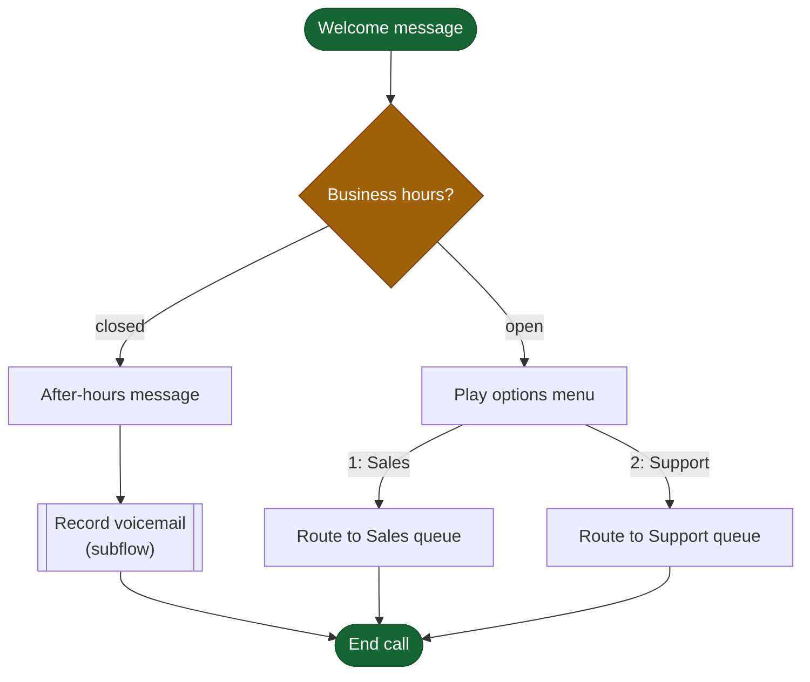

# Flow Diagram Skill

Create diagrams as Mermaid — text-based, diffable, and rendered natively wherever this plugin is actually used: GitHub (READMEs, PRs, issues), Claude artifacts, and most docs tooling. No build step, no CDN dependency in the common case.

For a graph with fewer than 3 nodes or no edges, use plain text (a sentence or a markdown table) — a diagram earns its place only when the connections themselves are the point.

## Before writing syntax: design the diagram, don't just transcribe data

A professional diagram reads correctly in under five seconds. That comes from three decisions made *before* the first `-->`, not from Mermaid syntax:

1. **Pick one shape per semantic category** and use it everywhere (see the shape catalog in `references/patterns.md`). A decision is always a rhombus, a terminal is always a stadium — never a rectangle in one diagram and a rhombus for the same concept in another.
2. **Pick one color per category** and apply it with `classDef`/`class` — never inline `style` per node, which drifts inconsistent across a diagram and can't be reused.
3. **Never encode meaning in color alone.** Pair every color category with a distinct shape or a text tag. A reader in grayscale (a printed PR diff, a colorblind teammate) must still be able to tell categories apart.

Skipping this step is the single biggest gap between "a diagram" and "a diagram that reads like it was designed."

## Workflow

### 1. Pick the diagram type

| Data | Mermaid type |
|---|---|
| Flows, pipelines, decision branches | `flowchart TD` (top-down) or `LR` (left-right, for wide/shallow graphs) |
| State machines | `stateDiagram-v2` |
| Dependencies, architecture maps | `flowchart LR` with `subgraph` groupings per layer/module |
| Sequences of calls between systems | `sequenceDiagram` |

Choose direction by the graph's natural shape: a deep hierarchy (a call chain, a task-to-task flow) reads better `TD`; a wide comparison (many independent branches, a dependency fan-out) reads better `LR`. Wrong direction is the most common cause of a diagram nobody wanted to untangle.

### 2. Assign shapes and node IDs

Read `references/patterns.md` for the full shape catalog and the Genesys Architect flow mapping. Give every node a short, meaningful, stable id — `Welcome`, `CheckBalance`, `TransferSales`, never `A1`/`A2`/`n7`. Meaningful ids are what make Mermaid's diffability real: a renamed node produces a one-line diff, not a reshuffled mess of anonymous letters.

### 3. Write the diagram



Syntax rules that avoid silent breakage:
- **Quote any label containing parentheses, colons, quotes, or other punctuation**: `A["Play message (after hours)"]`. An unquoted special character doesn't error — it just silently mangles the rendered shape.
- **`end` (lowercase) is reserved** in flowcharts — never use it as a node id (breaks `subgraph...end` parsing). Use `Finish`, `Stop`, or similar.
- **Edge labels use pipes**: `A -->|label| B`. For a label containing `|` itself, quote it: `A -->|"a|b"| B`.
- **`classDef`/`class` come after the edges they style**, at the end of the diagram — keeps the graph definition and its styling visually separate and easy to scan.

### 4. Add a legend whenever you use color or shape coding

Mermaid has no built-in legend. Two options, in order of preference:

- **A markdown legend beneath the fenced block** (the default — works everywhere, costs nothing, never competes for diagram space):
  ```markdown
  **Legend**: 🟢 terminal · 🟠 decision · ⬜ action
  ```
- **An in-diagram legend cluster**, only when the diagram must be fully self-contained (embedded in a standalone HTML file with no surrounding caption — see step 6):
  ```mermaid
  subgraph Legend
      direction LR
      L1(["terminal"]):::terminal
      L2{"decision"}:::decision
  end
  ```

Skipping the legend is the most common reason a technically-correct diagram still confuses its reader — color and shape only communicate once their meaning is stated.

### 5. Deliver it where it will actually render

Mermaid source is only a picture where something renders it. A fenced block printed into a Claude Code terminal shows as **raw source text, not a diagram**.

| Destination | Deliver as |
|---|---|
| GitHub PR/issue description, README, a committed `.md` file | Fenced ` ```mermaid ` block — inline in the response, or written to the file |
| The user wants to look at it now, in a Claude Code session ("show me", "let me see it") | A published Artifact (renders Mermaid natively — no library, no CDN) or a standalone HTML file (step 6) — never bare source in the terminal |
| Web/desktop chat, or docs tooling that renders Mermaid | Fenced ` ```mermaid ` block |

Always show the Mermaid source inline alongside a file or Artifact when it's short — it's the reviewable, diffable form, and hiding it defeats the reason to use Mermaid at all.

Do not hand-pick a `theme` init directive for a diagram destined for GitHub or a Claude artifact — both render Mermaid using their own host theme (including light/dark), and forcing one fights the host rather than adapting to it. Reserve explicit theming for the standalone-HTML case below, where you control the whole page.

### 6. Standalone HTML (when the user needs an openable file outside any host)

```html
<!doctype html>
<html>
<body style="margin:0;padding:24px;background:#0f172a">
<pre class="mermaid">
flowchart TD
    A(["..."]) --> B["..."]
</pre>
<script type="module">
  import mermaid from 'https://cdn.jsdelivr.net/npm/mermaid@11/dist/mermaid.esm.min.mjs';
  mermaid.initialize({ startOnLoad: true, theme: 'dark' });
</script>
</body>
</html>
```

The page background must match the chosen theme — a `dark`-themed diagram on a default white page renders washed out and low-contrast. This wrapper needs internet access when opened (Mermaid loads from a CDN); the plain markdown form has no such dependency.

### 7. Manage scale

Layout is automatic and cannot be hand-tuned node-by-node. For a dense graph (30+ heavily cross-linked nodes):
- Group related nodes into `subgraph` clusters — this alone fixes most readability problems, since it gives the auto-layout engine a hint about locality.
- Otherwise, split into multiple focused diagrams (e.g., one per task in a large Architect flow) rather than forcing everything into one view.

## Limits

Output is static — no pan, zoom, or drag. If the user asks for an interactive or explorable diagram, say plainly that this skill produces static Mermaid diagrams, then offer a browser-viewable HTML file (step 6) or a published Artifact, plus splitting a large graph into focused views. Do not build a bespoke interactive diagram library integration instead — that reintroduces the CDN-fragility and maintenance cost this skill deliberately avoids.

## Reference Files

- **`references/patterns.md`** — the full shape catalog with semantic meaning, the recommended color palette, subgraph/layout patterns, and the specific shape/color mapping for visualizing `flow_ir` output (task-start, action, branch-output, terminal, and warning-flagged nodes).
