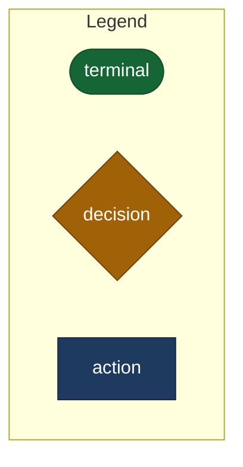
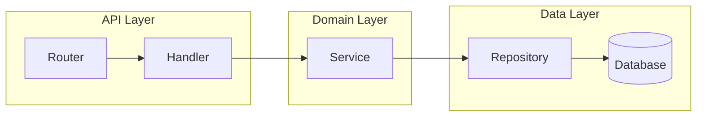
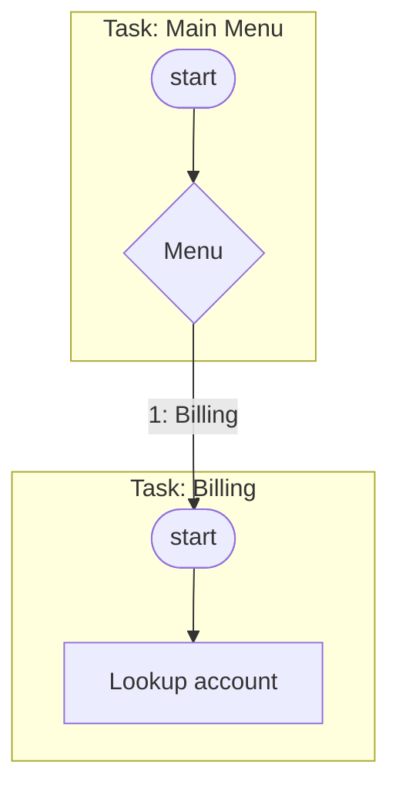

# Mermaid Diagram Patterns

## Shape Catalog

Mermaid's classic flowchart shapes carry conventional meaning borrowed from
standard flowcharting. Use the same shape for the same concept in every
diagram — consistency is what lets a reader learn the vocabulary once.

| Shape | Syntax | Semantic meaning |
|---|---|---|
| Stadium (pill) | `id(["Text"])` | Start / end / terminal state |
| Rectangle | `id["Text"]` | A process step / action |
| Rhombus | `id{"Text"}` | A decision / branch point |
| Subroutine | `id[["Text"]]` | A call into a reusable sub-flow or sub-task |
| Parallelogram | `id[/"Text"/]` | Input / output, data entering or leaving the flow |
| Cylinder | `id[("Text")]` | A data store (database, queue, cache) |
| Double circle | `id((("Text")))` | A hard stop / error terminal, distinct from a normal end |
| Hexagon | `id{{"Text"}}` | A preparation / configuration step |

Always quote the label text (`id["Text"]`, not `id[Text]`) — it is the only
form that survives punctuation safely across every shape.

## Color Palette

Apply color with `classDef` + `class`, never inline `style` per node. Define
the palette once at the bottom of the diagram:

```mermaid
flowchart TD
    classDef terminal fill:#166534,stroke:#14532d,color:#fff
    classDef errorTerminal fill:#7f1d1d,stroke:#450a0a,color:#fff
    classDef decision fill:#a16207,stroke:#713f12,color:#fff
    classDef action fill:#1e3a5f,stroke:#1e293b,color:#fff
    classDef warning fill:#78350f,stroke:#451a03,color:#fff,stroke-width:3px
```

These are dark-background-safe colors with light text — legible whether the
host renders in light or dark mode, since Mermaid's own node borders and
default text keep working around them. Never rely on a hue distinction alone
(e.g. two shades of blue for two different meanings) — pair every color with
a distinct shape from the catalog above, so the diagram still communicates
in grayscale.

## Legend Cluster Pattern

For a self-contained diagram (standalone HTML, no surrounding caption):



Place the legend subgraph first or last in the source (renders at an edge of
the layout, not competing with the main graph's center).

## Subgraph / Layout Patterns

**Grouping by module or layer** (architecture/dependency diagrams):



**Grouping by task** (a multi-task Architect flow — one subgraph per task
keeps the auto-layout from tangling cross-task edges):



Prefer `LR` for a wide, shallow architecture map (few layers, many parallel
components) and `TD` for a deep hierarchy or a step-by-step flow.

## Mapping `flow_ir` Output to Diagram Shapes

When visualizing the graph produced by this plugin's `flow_ir` tool
(`parseFlow`'s `IRNode`), map its `kind` and `terminal` fields directly:

| IR field | Value | Shape | classDef |
|---|---|---|---|
| `kind` | `"task-start"` | Stadium `(["..."])` | `taskStart` |
| `kind` | `"action"`, `terminal: false` | Rectangle `["..."]` | `action` |
| `kind` | `"action"`, `terminal: true` | Stadium `(["..."])`, or double-circle `((("...")))` if it is `DisconnectAction`/an error path | `terminal` / `errorTerminal` |
| `kind` | `"branch-output"` | Rhombus `{"..."}` (it represents a decision outcome) or a small labeled point if the branch has only one outgoing edge | `decision` |

**Warnings**: give any node named in `ir.warnings[]` the `warning` classDef
(thick amber border) in addition to its normal shape/color — this overlays
onto the existing category rather than replacing it, so a warned decision
node stays visually a decision, just flagged. Never silently drop a warned
node from the diagram; the warning is exactly the thing worth surfacing.

**Disabled branches** (`DISABLED_BRANCH` warning): render the edge with a
dotted style (`-.->`) instead of a solid arrow — Mermaid supports this
natively and it reads immediately as "present in the flow but not live."

**Unresolved edges** (`UNRESOLVED_REFERENCE`, `UNRESOLVED_INITIAL_SEQUENCE`,
`UNRESOLVED_INTENT_FANOUT`): do not draw a dangling arrow to nothing — Mermaid
requires both endpoints to exist. Instead, add a small `errorTerminal`-styled
node named after the warning (e.g. `Unresolved1[["? unresolved"]]`) as the
edge's target, so the gap is visible rather than silently omitted.
